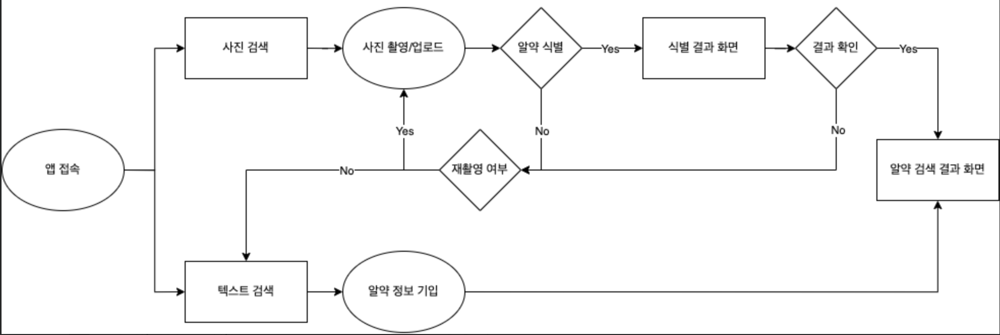

# 종합설계 프로젝트 알고싶은약(client)

## 프로젝트 정보

한국외대 AI융합전공 졸업필수과목인 종합설계 강의에서 진행한 프로젝트의 클라이언트 사이드.
 알약 사진으로 알약을 식별하는 프로젝트.
 
 개발 기간 : 2023.05 ~ 2023.06

#

## 유저플로우

 

 
 

## 사용 기술

   
   
   
  

 
 

## 화면 구성

| 직접검색                                                                                                        |
| --------------------------------------------------------------------------------------------------------------- |
|  |
| 사진검색                                                                                                        |
|   |

 
 

## 새로 알게된 점

- 미숙했던 await 사용 : response에도 await를 붙여줘야 깡통 값을 피한다
   https://stackoverflow.com/questions/56200562/how-to-fix-response-type-cors-when-trying-to-create-payment-through-paypal
- CORS에러 개념 공부
- Next.js Image가 Production 단계에서 깨지는(엑스박스) 문제 - unoptimized option 해제
   https://nextjs.org/docs/app/api-reference/components/image#unoptimized
- useRef 숙달 및 Array.prototype.map()으로 여러개의 Ref를 걸려면 배열을 사용해야 한다
   https://velog.io/@zerozoo-front/react-hooks-map-%EC%97%90%EC%84%9C-ref-%EB%A5%BC-%EC%A7%80%EC%A0%95%ED%95%98%EC%9E%90
